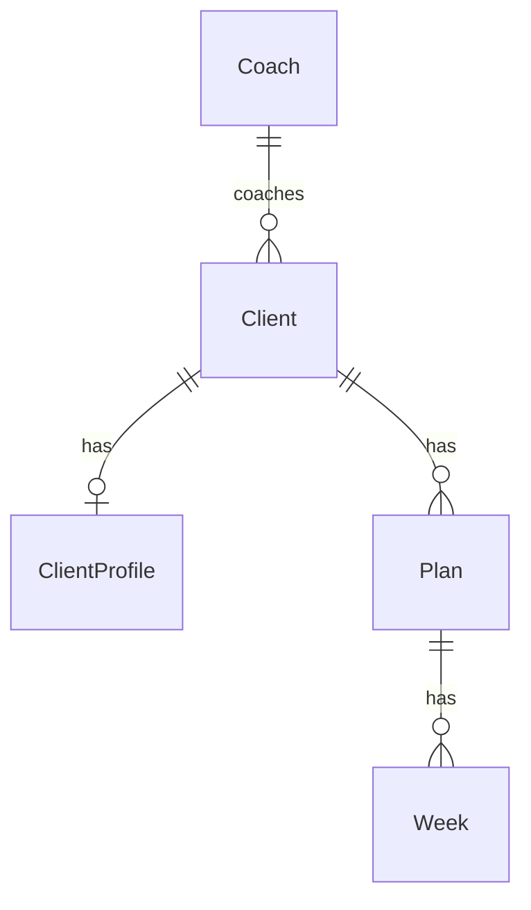

# Domain model (ER draft)

Vendor-agnostic, deliberately small production model. It keeps SQL for ownership, lifecycle, and history, but does **not** turn every day, exercise, and set into a database entity.

The plan is a structured document; each concrete week is a structured log. The database has five core records: **Coach → Client → ClientProfile / Plan / Week**.



```typescript
type Uuid = string;
type ISODate = string;
type ISODateTime = string;

type DayType = "upper_body" | "leg_day" | "rest" | "swimming" | "cardio";
type ClientStatus = "active" | "archived";
type PlanStatus = "draft" | "active" | "archived";
type WeekStatus = "in_flight" | "completed" | "abandoned";
type ExerciseFeedback = "easy" | "hard" | "heavy" | "light";
```

---

## Coach

```typescript
type Coach = {
  id: Uuid;
  display_name: string;
  auth_subject_id: string | null;
  created_at: ISODateTime;
  updated_at: ISODateTime;
};
```

## Client

```typescript
type Client = {
  id: Uuid;
  coach_id: Uuid; // FK → Coach
  display_name: string;
  status: ClientStatus;
  created_at: ISODateTime;
  updated_at: ISODateTime;
};
```

## ClientProfile

One current coaching profile per client. Keep complex, rarely-filtered coaching information as JSON rather than prematurely normalizing it.

```typescript
type ClientProfile = {
  id: Uuid;
  client_id: Uuid; // FK → Client, unique
  snapshot_date: ISODate;
  sex: string | null;
  age: number | null;
  height_cm: number | null;
  goals: Record<string, unknown>;
  body_composition: Record<string, unknown>;
  strength_loads: Record<string, unknown>;
  nutrition: Record<string, unknown> | null;
  swimming: Record<string, unknown> | null;
  schedule_preferences: Record<string, unknown> | null;
  notes: string | null;
  updated_at: ISODateTime;
};
```

## Plan

One generated or imported training block. `week_template` replaces `BlockWeekTemplate`, `TemplateDay`, and `TemplateExercise` as separate records.

```typescript
type Plan = {
  id: Uuid;
  client_id: Uuid; // FK → Client
  label: string; // e.g. "Block 2"
  status: PlanStatus;
  total_weeks: number;
  week_template: PlanDay[];
  rationale: string | null;
  activated_at: ISODateTime | null;
  created_at: ISODateTime;
  updated_at: ISODateTime;
};

type PlanDay = {
  day_index: number; // 1–7
  type: DayType;
  notes: string | null;
  exercises: PlannedExercise[];
};

type PlannedExercise = {
  /** Stable history key, e.g. `press_banca`. */
  exercise_key: string;
  name: string;
  series: number;
  reps: number;
  rest_time_sec: number;
  weight_kg: number | null;
  notes: string | null;
};
```

**Invariant:** at most one active plan per client. Activating a plan archives the previous active plan; it does not delete it.

## Week

A concrete, dated log for one plan week. It owns completion and performance data, and may include adjustments made by the weekly AI workflow. It replaces `WeekInstance`, `DayInstance`, and `ExerciseInstance`.

```typescript
type Week = {
  id: Uuid;
  client_id: Uuid; // FK → Client
  plan_id: Uuid; // FK → Plan
  week_index: number; // 1 .. plan.total_weeks
  start_date: ISODate;
  end_date: ISODate;
  status: WeekStatus;
  /** Snapshot of the planned work for this week, including AI adjustments. */
  schedule: WeekDay[];
  created_at: ISODateTime;
  updated_at: ISODateTime;
};

type WeekDay = {
  day_index: number;
  date: ISODate;
  type: DayType;
  notes: string | null;
  completed: boolean;
  completed_at: ISODateTime | null;
  exercises: ExerciseLog[];
};

type ExerciseLog = {
  /** Matches the plan exercise unless the week intentionally changes it. */
  exercise_key: string;
  name: string;
  /** The athlete did not perform this exercise this week. */
  skipped: boolean;
  /** Controlled athlete feedback; not free-form coaching notes. */
  feedback: ExerciseFeedback | null;
  prescribed: {
    series: number;
    reps: number;
    rest_time_sec: number;
    weight_kg: number | null;
    notes: string | null;
  };
  /** One entry per performed set; can be empty before training. */
  sets: Array<{
    performed_reps: number;
    performed_weight_kg: number | null;
  }>;
};
```

**Invariants:**
- At most one `in_flight` week per client.
- A completed week remains immutable except for explicit coach corrections.
- `schedule` is a snapshot. Subsequent plan edits must not rewrite historical weeks.
- A skipped exercise has `skipped: true` and normally no performed sets.

---

## Lifecycle

1. Generate/import a `Plan` with its canonical `week_template`.
2. Activate it and create `Week` 1 by copying the template into `schedule`.
3. The user records set results in `Week.schedule[].exercises[].sets`.
4. Complete the week; use its logs as workflow input, then create the next `Week` with any AI adjustments.
5. Generate a new plan at block end; archive the old plan but retain every old week.

---

## Why this is still SQL

`Coach`, `Client`, `ClientProfile`, `Plan`, and `Week` are SQL rows with IDs, ownership, timestamps, statuses, and foreign keys. `Plan.week_template` and `Week.schedule` are JSON columns validated by shared Zod schemas.

This keeps the important queries simple:

- active plan / current week for a client
- all completed weeks for a plan
- plan and week history per client

It deliberately postpones cross-client analytics such as “all bench-press sets across every athlete.” If that becomes a real feature, extract `ExerciseLog` into relational rows later; do not pay that complexity before it is needed.

---

## Explicitly out of this file

- Organization / membership / SaaS roles
- `JobRun` / `LlmCall`
- Chat session storage
- Full exercise catalog
