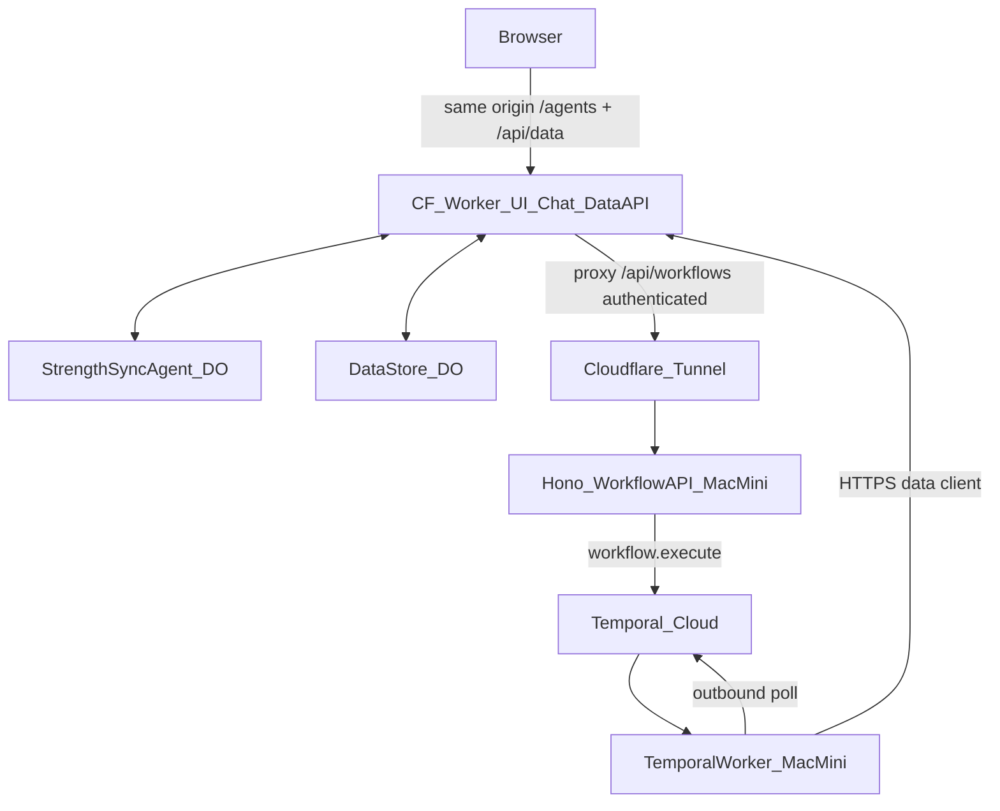

# Migration plan — decouple for Cloudflare deploy

Target: deploy the Vite UI + chat on Cloudflare; keep Node-only pieces (Temporal worker + workflow API) on the Mac Mini as a private POC backend; replace JSON files with a Durable Object data store so every consumer sees the same live state.

Companion: [system_design.md](./system_design.md) (as-is).

## Requirements (locked)

| Requirement | Decision |
| --- | --- |
| Chat on Cloudflare | Keep `StrengthSyncAgent` DO + Worker; no change to chat runtime |
| Replace data files | **Data Durable Object** storing the same JSON shapes (progress / program / profile) |
| API ≠ Temporal | Split today’s Hono into **data API** (CF Worker) and **workflow API** (Node on Mac Mini) |
| Node stays local | Mac Mini only: Temporal worker + workflow API. Temporal Cloud for orchestration (worker is outbound-only) |
| Vite on Cloudflare | Same Worker assets deploy as today (`wrangler deploy` / Vite CF plugin) |
| Less Tailscale | Browser talks **only** to the Cloudflare origin. Mac Mini is not LAN-reachable to clients |
| Public URL | **`app.strengthsync.ai`** — this Worker/SPA; apex `strengthsync.ai` stays the existing Next.js landing |

## Domains

Standard split: marketing site and product app on different hosts, same brand domain.

| Host | App | Platform |
| --- | --- | --- |
| `strengthsync.ai` / `www` | Landing (existing Next.js) | Whatever hosts it today (e.g. Vercel) |
| `app.strengthsync.ai` | This Vite UI + chat + data API | Cloudflare Worker (custom domain) |

DNS (once the zone is on Cloudflare, or via CNAME to Workers):

1. Add custom domain `app.strengthsync.ai` to the Worker in the Cloudflare dashboard / `wrangler` routes.
2. Create DNS record: `app` → Worker route (Cloudflare-managed) or CNAME to `*.workers.dev` if the apex lives elsewhere and you only delegate the subdomain.
3. Browser origin for the product is always `https://app.strengthsync.ai` — same-origin for `/agents/*`, `/api/data/*`, and the workflow proxy. No CORS needed for those.
4. Landing CTAs link to `https://app.strengthsync.ai`. Cookies are not shared with the apex unless you explicitly set a parent-domain cookie later (POC: no shared auth cookies).

If the apex DNS is **not** on Cloudflare today, you can still point only `app` at Cloudflare (CNAME) without moving the Next.js site.

## Target architecture

### What runs where

| Piece | Where | Inbound? |
| --- | --- | --- |
| SPA assets + chat + **data API** | Cloudflare Worker at `app.strengthsync.ai` | Public (app origin) |
| `StrengthSyncAgent` DO | Cloudflare | Via Worker only |
| **DataStore DO** | Cloudflare | Via Worker only |
| Workflow API (Hono, workflow routes only) | Mac Mini | **No** — only via Cloudflare Tunnel, called by the Worker proxy |
| Temporal worker | Mac Mini | **No** — polls Temporal Cloud outbound; calls data API outbound |
| Temporal server | Temporal Cloud | N/A (SaaS) |

Security model for the POC: the Mac Mini never accepts browser traffic. The Worker proxies `/api/workflows/*` to the tunnel hostname with a shared secret (`WORKFLOW_API_SECRET`). The Temporal worker authenticates to the data API the same way (`DATA_API_SECRET`). Tailscale is unused in the target.

### DataStore DO (shape)

Keep the discovery-phase JSON model; move it behind one DO (single-user POC → one DO id, e.g. `default`):

- `client_profile` — object
- `programs` — list of timestamped program snapshots; newest = active
- `progress` — list of timestamped week snapshots; newest = in-flight
- Optional: `training_rules` markdown (or keep as a Worker-bundled static file for v1)

Worker routes (illustrative):

- `GET/PUT /api/data/profile`
- `GET /api/data/program` (active) · `GET /api/data/programs` · `POST /api/data/programs`
- `GET /api/data/progress` (current week) · `GET /api/data/progress/history` · `PUT /api/data/progress/day` · `POST /api/data/progress` (archive / seed)

Chat tools and Temporal activities both use this API (Worker → DO binding in-process; Mac Mini → HTTPS).

### Service split

| Today (Hono `:3001`) | After |
| --- | --- |
| `GET /api/progress/history` | Data API on CF Worker |
| `POST /api/progress/day` | Data API on CF Worker |
| `POST /api/workflows/*` | Workflow API on Mac Mini (proxied by CF Worker) |
| Direct `fs` in activities | HTTP client → Data API |

UI stops using `import.meta.glob` for program/progress; it fetches the data API (same origin when deployed).

## Migration phases

Do these in order. Each phase should leave the app runnable (local or hybrid).

### Phase 0 — Prerequisites

- Confirm Temporal Cloud namespace + API key (already supported via `.dev.vars`).
- Confirm `pnpm deploy` serves UI + chat agent on a `*.workers.dev` URL, then attach custom domain `app.strengthsync.ai`.
- Install `cloudflared` on the Mac Mini (tunnel created later in Phase 5).
- No code required yet.

### Phase 1 — DataStore DO + seed

- Add `DataStore` Durable Object (SQLite or in-memory JSON blob API) bound in `wrangler.jsonc`.
- Implement Worker HTTP handlers under `/api/data/*` that read/write the DO.
- One-shot seed script: load current `src/app/dashboard/**/*.json` into the DO.
- Smoke-test with `curl` against local Worker.

**Exit:** data lives in a DO; files remain as seed/backup only.

### Phase 2 — Point Node writers at the Data API

- Replace `fs` usage in `src/temporal/progressFile.ts` / activities / analysis tools with a small HTTP client (`DATA_API_URL` + `DATA_API_SECRET`).
- Add the provider-backed `LlmCallRecorder` to the shared agent core and inject it from Temporal activities. Every workflow LLM call, including failures, must be forwarded to the observability/evaluation provider; do not persist call traces in the DataStore DO.
- Keep Hono progress routes as thin proxies to the Data API **or** delete them and have the UI call the Worker directly (prefer delete once UI is ready).
- Locally: Vite CF plugin Worker provides `/api/data`; Temporal processes call `http://localhost:5173` (or the Worker dev URL).

**Exit:** Temporal + Hono no longer touch the filesystem for dashboard JSON, and all workflow LLM calls are observable/evaluable outside the product data store.

### Phase 3 — UI reads/writes via Data API

- Replace `getCurrentProgress` / `getCurrentProgram` glob helpers with fetch to `/api/data/...`.
- Wire Plan day saves and History to the same-origin data API.
- Drop `VITE_TEMPORAL_API_URL` for progress routes; keep it only if still hitting Hono for workflows during transition.

**Exit:** UI and Temporal share live DO state (no rebuild/HMR to see writes).

### Phase 4 — Chat tools use Data API

- Change `src/worker/agent/tools/*` to call the DataStore via DO binding (preferred) or internal `env` fetch — not bundled JSON.
- Remove tool dependency on `src/ui/utils/getCurrent*`.

**Exit:** chat sees the same live data as the dashboard and workflows.

### Phase 5 — Split APIs + Mac Mini deploy path

- **Workflow API** (`src/temporal/server.ts`): keep only `/health` + `/api/workflows/*`; remove progress routes.
- **CF Worker**: add `/api/workflows/*` proxy → tunnel URL + secret header.
- Mac Mini systemd (or launchd) units:
  1. `cloudflared tunnel` → `localhost:3001`
  2. `pnpm temporal:api` (workflow API only)
  3. `pnpm temporal:worker` (Temporal Cloud + data API client)
- Deploy Worker+UI to Cloudflare; bind `app.strengthsync.ai`. Set secrets: `OPENAI_API_KEY`, `WORKFLOW_API_URL` (tunnel), `WORKFLOW_API_SECRET`, `DATA_API_SECRET`.
- Browser: only `https://app.strengthsync.ai`. No Tailscale, no direct Mac Mini ports. Landing stays on `strengthsync.ai`.

**Exit:** production-shaped POC on `app.strengthsync.ai`; Tailscale optional for SSH admin only, not for app traffic.

### Phase 6 — Cleanup

- Delete or archive `src/app/dashboard/**` as runtime store (keep fixtures for tests/seed).
- Remove Tailscale-oriented README / `preview:tailscale` if unused.
- Update [system_design.md](./system_design.md) to describe the target as the new as-is (or add a short “deployed” section).
- Document Mac Mini ops: restart worker/api/tunnel, rotate secrets.

## Out of scope (POC)

- Multi-user auth / per-user DO ids (single `default` store is enough).
- Running Temporal on Cloudflare (not possible with the SDK today).
- Replacing Temporal with Queues/Workflows on CF.
- Hardening beyond shared secrets + tunnel (CF Access can be added later).

## Risk notes

- **Long `workflow.execute` HTTP** — plan-generation can take 30–90s; Worker proxy must allow a long timeout, or switch to async start + poll later.
- **Data API as SPOF for activities** — if the Worker is down, Temporal activities fail; rely on Temporal retries.
- **Secret distribution** — same `DATA_API_SECRET` on Worker and Mac Mini; rotate by updating both.
- **Local DX** — after Phase 2, `temporal:api` / `temporal:worker` need the Worker (or deployed data URL) up; document the three-process local loop clearly.
