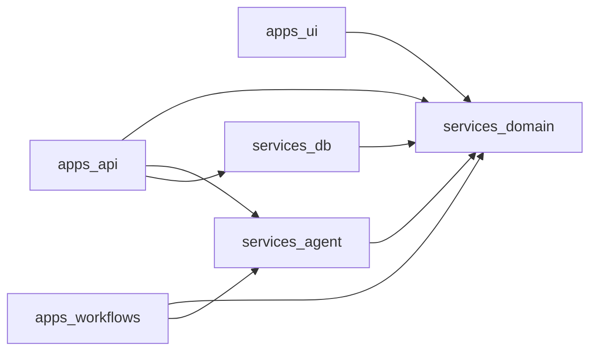

# Monorepo structure and dependency rules

Target repository structure for the production application. It defines ownership and import boundaries, not a choice of deployment vendor or build orchestrator.

```text
apps/
  ui/                         # Browser application
  api/                        # Public HTTP API and chat routing
  workflows/                  # Node workflow worker and private start API
    src/
      activities/
      workflows/
      observability/
        braintrust-recorder.ts  # implements LlmCallRecorder
    evals/
      weekly-analysis.eval.ts
      plan-generation.eval.ts
services/
  domain/                     # Contracts and pure business logic
  agent/                      # Runtime-agnostic LLM helpers
  db/                         # Database schema, migrations, and repositories
```

Each directory is a workspace package with its own `package.json`, TypeScript config, tests, and explicit dependencies. The root workspace owns shared linting, formatting, TypeScript base config, task scripts, and lockfile.

## Dependency graph



The graph is deliberately one-way:

- `services/domain` imports **nothing** from the other project workspaces.
- `services/agent` imports `services/domain`, never a runtime app or database.
- `services/db` imports `services/domain` types/contracts where useful, never apps or the agent. With the selected D1 stack, only `apps/api` imports it.
- Apps may import services, but **never each other**. API starts workflows through an authenticated private HTTP/RPC boundary; it does not import the workflow worker.

## `apps/ui`

Browser-only React application.

**Owns**

- Screens and components: plan tracker, history, chat panel
- Client-side state, navigation, optimistic updates, polling job status
- Calls to the public API

**May import**

- `services/domain/contracts`: API request/response types and Zod schemas safe for the browser
- `services/domain/presentation`: pure display helpers, constants, day types

**Must not import**

- `services/db`
- `services/agent`
- Temporal SDK or workflow code
- Server environment variables, filesystem, Node-only packages

**Dependency rule:** UI only knows HTTP contracts. It never knows a database table, SQL query, workflow activity, or provider SDK.

## `apps/api`

The only browser-facing backend. Its runtime must support HTTP, streaming chat, authentication, and database access.

**Owns**

- Authentication and authorization boundary
- Public REST/RPC endpoints for clients, profiles, plans, and weeks
- Validation of browser inputs
- Chat session routing and streaming response
- Async workflow start proxy: validate caller → create/start job request → return immediately

**May import**

- `services/domain`
- `services/agent` for chat only
- `services/db` for the public data API
- Its own runtime/platform adapter code

**Must not import**

- `apps/ui`
- `apps/workflows`
- Temporal worker/activity implementation

**Dependency rule:** it may request a workflow start but must not execute, poll, or wait for the workflow itself. Browser requests must not remain open for LLM plan generation.

## `apps/workflows`

Node-only private service: durable workflow definitions, activities, and a small authenticated endpoint to start them.

**Owns**

- Workflow definitions: weekly progression and new-plan generation
- Activity implementations: load context, invoke LLM, validate output, write next state
- Worker process configuration and workflow retry/time-out policies
- Mandatory forwarding of every LLM call to the configured observability/evaluation provider
- Private job-start endpoint used by `apps/api`

**May import**

- `services/domain`
- `services/agent`
- `services/db`
- Node and workflow-orchestrator SDKs

**Must not import**

- `apps/ui`
- `apps/api`
- Browser packages or edge-only runtime bindings

**Dependency rule:** with D1, workflows cannot import `services/db` because D1 is a Worker binding. They call authenticated internal data endpoints in `apps/api`; they do not read local JSON files or call UI code. Their start endpoint is private and service-authenticated, never directly called by the browser.

## `services/domain`

Pure shared business language. It must work in browser, edge, and Node runtimes.

**Owns**

- Domain types and Zod schemas: `Coach`, `Client`, `ClientProfile`, `Plan`, `Week`, schedules, logs
- Public API request/response DTOs
- LLM input/output DTOs and mapping/validation functions
- Coaching rules and prompt builders
- Pure lifecycle rules, e.g. “which plan status transition is valid”

**May import**

- Runtime-neutral packages only, e.g. Zod

**Must not import**

- Database clients/ORMs
- HTTP frameworks, platform SDKs, Node APIs, filesystem
- LLM provider SDKs
- Any `apps/*` package

**Public exports**

```text
@strengthsync/domain/contracts   # browser-safe DTOs and schemas
@strengthsync/domain/model       # core entities and value types
@strengthsync/domain/coach       # rules, prompts, LLM DTO mapping
```

Do not expose internal file paths as a de facto API. Each package should define a short explicit export surface.

## `services/agent`

Provider-independent wrappers around streaming text, static text, and structured-object generation.

**Owns**

- `streamText`, `generateText`, and `generateObject` adapters
- Provider/model configuration passed explicitly by the calling app
- Consistent call input/output envelopes
- Hooks/interfaces for mandatory `LlmCall` trace capture

**May import**

- `services/domain` for schemas, prompt inputs, and result DTOs
- AI SDK/provider packages

**Must not import**

- `services/db`: tracing is injected as an interface, so agent code stays usable in edge and Node
- `apps/*`
- Authentication or tenancy code

**Required interface**

```typescript
type LlmCallRecorder = {
  record(input: {
    /** Provider trace/workflow correlation; no product DB record is required. */
    workflow_id: string | null;
    client_id: string;
    step: string;
    model: string;
    input: unknown;
    output: unknown | null;
    error: string | null;
    latency_ms: number;
  }): Promise<void>;
};
```

`apps/workflows` supplies a recorder backed by the chosen observability/evaluation provider (Braintrust in the current direction). The agent helper must call it for every workflow LLM request, including failures.

The recorder forwards traces to the provider; it does **not** persist `LlmCall` rows in the product database. Keeping the interface in `services/agent` makes that provider integration mandatory without coupling LLM generation to one provider SDK.

## `services/db`

Persistence adapter for the relational system of record.

**Owns**

- Drizzle schema, migrations, indexes, and D1 repository helpers
- Repository/query functions for `Coach`, `Client`, `ClientProfile`, `Plan`, and `Week`
- Persistence mappings between SQL JSON columns and `services/domain` contracts

**May import**

- `services/domain`
- ORM/query client and database driver

**Must not import**

- `services/agent`
- `apps/*`
- HTTP or workflow SDKs

**Dependency rule:** expose intent-level operations (`getCurrentWeek`, `completeWeek`, `createNextWeek`) to `apps/api`, not raw SQL tables. Multi-write lifecycle invariants use Drizzle's D1 `db.batch([...])` operations; do not use standard ORM transactions with D1. Node workflows use the API's authenticated internal endpoints instead of this package.

## Workspace setup

Use the existing `pnpm` package manager in workspace mode.

```yaml
# pnpm-workspace.yaml
packages:
  - apps/*
  - services/*
```

Root responsibilities:

```text
package.json                  # shared scripts: typecheck, lint, test, build
pnpm-workspace.yaml           # workspace discovery
tsconfig.base.json            # strict shared compiler settings
eslint.config.*               # import-boundary and code-quality rules
```

Per-workspace responsibilities:

```text
apps/ui/package.json
apps/ui/tsconfig.json
apps/api/package.json
apps/api/tsconfig.json
apps/workflows/package.json
apps/workflows/tsconfig.json
services/domain/package.json
services/domain/tsconfig.json
services/agent/package.json
services/agent/tsconfig.json
services/db/package.json
services/db/tsconfig.json
```

Declare workspace dependencies explicitly (for example, `"@strengthsync/domain": "workspace:*"`). Do not rely on root dependency hoisting: a workspace must list every runtime package it imports.

## Enforcement

- TypeScript project references build shared services before apps.
- Package `exports` prevent deep imports across workspaces.
- ESLint import restrictions enforce the graph above.
- CI runs root typecheck, lint, unit tests, and a dependency-graph check.
- Separate runtime TypeScript configs: browser (`ui`), edge (`api`), and Node (`workflows`). Shared services must compile against every runtime they claim to support.
- Workflow tests assert that every LLM activity receives a recorder; production configuration fails fast when the observability provider is unavailable or unconfigured.

## Migration mapping

| Current POC path                                   | Target workspace                         |
| -------------------------------------------------- | ---------------------------------------- |
| `src/ui/`                                          | `apps/ui/`                               |
| `src/worker/`                                      | `apps/api/`                              |
| `src/temporal/`                                    | `apps/workflows/`                        |
| `src/agent/`                                       | `services/agent/`                        |
| `src/temporal/schemas.ts`, prompts, coaching rules | `services/domain/`                       |
| `src/app/dashboard/**`                             | fixtures/seed inputs; no runtime storage |
