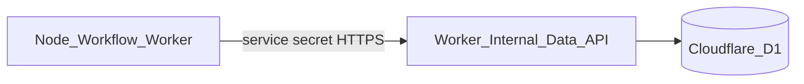
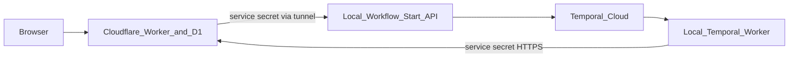

# MVP stack

Committed providers and platform choices for the MVP. This is intentionally a small, low-operations stack; free usage is used where it is genuinely available, not assumed where it is only a trial.

## Decisions

| Concern | MVP choice | Free-usage status | Decision |
| --- | --- | --- | --- |
| Product access | HTTP Basic Authentication | No provider cost | Use one shared coach credential, enforced by the API Worker |
| Public API + chat | Hono on Cloudflare Workers | Yes | Use the existing Worker direction |
| SQL database | Cloudflare D1 + Drizzle ORM | Yes | Use D1 as the system of record and Drizzle as its typed data layer |
| Workflow worker | Local machine + Docker Compose | No provider cost | Run the Node worker, private start API, and tunnel as containers |
| Orchestration | Temporal Cloud | Trial credits only | Use Temporal Cloud; retain current workflow model |
| LLM evals/tracing | Braintrust | Yes | Mandatory workflow tracing/evals through `LlmCallRecorder` |
| General platform observability | Cloudflare | Included platform telemetry | Use Cloudflare logs/analytics for Worker and D1 operations |
| CI/CD | GitHub Actions | Yes | Build, test, and deploy from GitHub Actions |
| LLM | OpenAI API | No guaranteed permanent free tier | Continue with the current provider; set a spending limit |

## Access: HTTP Basic Authentication

Use Hono's Basic Auth middleware (or an equivalent constant-time credential check) at the edge.

- Store the shared username/password as Worker secrets, never in the browser bundle or repository.
- Require HTTPS; Basic credentials are sent on every authenticated request and are only Base64-encoded, not encrypted by the scheme itself. See [RFC 7617 background](https://en.wikipedia.org/wiki/Basic_access_authentication).
- Protect all data, workflow-start, and chat routes. Static SPA assets may be public because they contain no client data; if the entire app must be password-protected, route asset delivery through the Worker after the same check.
- This is **not user identity**: it has no per-user ownership, roles, invitation flow, or reliable logout. It is appropriate only while the MVP is private and single-coach.

No external auth provider is needed for the MVP. Replacing this later with real identity must happen before exposing client-facing accounts.

## Cloudflare Workers + Hono

Cloudflare Workers remains the public API, SPA edge layer, streaming chat gateway, and D1 access layer. Hono is the HTTP framework.

The Workers Free plan currently includes 100,000 requests per day and 10 ms CPU per request ([pricing](https://developers.cloudflare.com/workers/platform/pricing/), [limits](https://developers.cloudflare.com/workers/platform/limits/)). That is sufficient for a small private MVP; move to Workers Paid before traffic or API CPU work requires it.

## Cloudflare D1

D1 is the relational system of record for `Coach`, `Client`, `ClientProfile`, `Plan`, and `Week` described in [domain_model.md](./domain_model.md). `services/db` uses Drizzle ORM's D1 driver for its schema, migrations, typed queries, and repository layer.

The D1 Free plan currently includes 5 million rows read/day, 100,000 rows written/day, and 5 GB total storage; per-database size is 500 MB and free-plan query access stops until the daily reset if an allowance is exceeded ([pricing](https://developers.cloudflare.com/d1/platform/pricing/), [limits](https://developers.cloudflare.com/d1/platform/limits/)).

### Important boundary

D1 is available to Workers via a binding. The Node workflow worker on the local machine does **not** get that binding.

Therefore:

- `apps/api` owns all D1 reads/writes.
- `apps/workflows` calls private `/internal/*` data endpoints using a service secret.
- The browser never reaches internal endpoints.
- There is one data writer boundary, even though the workflow executes on Node.

This is a necessary trade-off for choosing D1 instead of a network-accessible SQL database.

### Atomic writes

D1 does not support standard `BEGIN`/`COMMIT` transactions. It does provide atomic `batch()` execution: if a statement in the batch fails, D1 rolls back the sequence ([D1 batch documentation](https://developers.cloudflare.com/d1/worker-api/d1-database/)).

Use Drizzle's D1 `db.batch([...])` API for lifecycle commands that must be atomic, including archiving the old plan, activating a new plan, and creating week 1. Never use `db.transaction()` with D1.

## Workflow worker: local machine

Run the Node workflow worker, private workflow-start API, and tunnel on the local machine as a Docker Compose project.

Use a Cloudflare Tunnel for the one inbound path:

The local machine runs:

- a containerized Temporal Node worker;
- a containerized, service-authenticated workflow-start endpoint behind the tunnel;
- a containerized Cloudflare Tunnel;
- no public browser API and no database.

The worker polls Temporal Cloud outbound. If the local machine is offline, Temporal retains workflow state and work waits/retries until the worker returns; the public API and chat remain online.

Operational requirements:

- start and stop the worker, start API, and tunnel manually through Docker Compose;
- keep the machine powered, networked, and patched;
- deploy through a controlled pull/restart procedure from CI or manually;
- keep the tunnel hostname private and require a service secret in addition to the tunnel.

This is appropriate for a private MVP, but it is not highly available. Moving the same processes to a managed Node host later must not change API or workflow code.

## Orchestration: Temporal Cloud

Use Temporal Cloud because the POC already models the weekly and plan-generation work correctly as Temporal workflows. It is the smallest migration from the current code and keeps retries, activity timeouts, and workflow visibility managed.

Temporal Cloud is **not permanently free**. New accounts receive $1,000 in credits for 90 days; the Essentials plan then starts at $100/month ([Temporal pricing](https://temporal.io/pricing), [pricing details](https://docs.temporal.io/cloud/pricing)).

This is the largest cost risk in the proposed MVP. It is suitable only if that post-trial cost is acceptable. If not, the alternative is self-hosting Temporal on the local machine, which removes the managed-orchestration benefit and adds Temporal server/database operations.

## Evals and LLM observability: Braintrust

Use Braintrust as the required observability and evaluation provider for all workflow LLM calls.

`apps/workflows` creates a Braintrust-backed `LlmCallRecorder` and passes it to `services/agent`. Every LLM call—including failures—must emit its trace before the activity returns.

- Traces, prompts, outputs, latency, and evaluation scores live in Braintrust, not D1.
- D1 remains product data only; do not introduce `LlmCall` tables for the MVP.
- `services/agent` stays provider-neutral because it depends only on the recorder interface described in [monorepo_structure.md](./monorepo_structure.md).

Braintrust Starter is a permanent $0 plan with 1 GB processed data/month, 10,000 scores/month, and 14-day retention ([pricing](https://www.braintrust.dev/pricing), [billing](https://www.braintrust.dev/docs/admin/billing)). This fits an MVP but requires a retention/overage review before production volume grows.

Cloudflare covers platform-level Worker/D1 logs and operational metrics. Braintrust covers LLM-specific traces and evals; they are complementary.

## CI/CD: GitHub Actions

GitHub Actions is the MVP pipeline:

1. Pull request: install, typecheck, lint, unit tests, and workflow/eval tests.
2. Main: build and deploy `apps/api`; deploy/restart the local workflow worker through its controlled service procedure; run schema migrations through the API/Worker deployment path.
3. Require workflow tests to prove every LLM activity receives an `LlmCallRecorder`.

GitHub Free currently includes 2,000 minutes/month and 500 MB artifact storage for private repositories; public-repository Actions usage is free ([GitHub Actions billing](https://docs.github.com/en/billing/concepts/product-billing/github-actions)). Keep artifacts small and configure an Actions spending limit.

## LLM: OpenAI API

Keep OpenAI for the MVP because the current agent core already uses it. This is a paid dependency; do not model it as a reliable free tier. Set a project budget, model allowlist, and per-workflow token limit from day one.

Do not opt into data-sharing token programs for client health/training context without an explicit privacy decision.

## Cost reality

The free-tier requirement is satisfied by Workers, D1, local worker hosting, Braintrust Starter, and GitHub Actions. It is **not** satisfied permanently by:

- Temporal Cloud after its credits expire;
- OpenAI API use.

This stack is still low-cost at MVP scale, but it is not a zero-cost production stack. Temporal Cloud's $100/month minimum is the cost that should be explicitly accepted or replaced before implementation begins.
