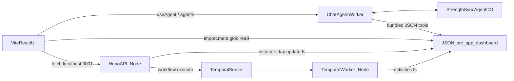

# System design (as-is)

High-level map of how StrengthSync is wired today. Visual companion: [system_design.excalidraw](./system_design.excalidraw).

This is a single monorepo with **two backends**: a Cloudflare Worker (chat agent + Durable Object) and a Node Temporal stack (Hono API + worker). JSON files under `src/app/dashboard/` are the discovery-phase data store.

## Components

| Component | Runtime | Role |
| --- | --- | --- |
| Vite React UI (`src/ui/`) | Browser | SPA: plan tracker, history, chat panel |
| Chat Agent Worker (`src/worker/`) | Cloudflare Workers | Routes `/agents/*` to the Durable Object via `routeAgentRequest` |
| `StrengthSyncAgent` DO | Workers (SQLite DO) | Chat session state + streaming replies (`AIChatAgent`) |
| Shared agent core (`src/agent/`) | Runtime-agnostic | OpenAI `streamText` / `generateText` / structured object calls |
| Hono API (`src/temporal/server.ts`) | Node (`:3001`) | UI HTTP API: progress reads/writes + workflow triggers |
| Temporal worker (`src/temporal/worker.ts`) | Node | Polls the `strengthsync` task queue; runs activities |
| Temporal server | Local CLI or Temporal Cloud | Workflow orchestration |
| Data files (`src/app/dashboard/`) | Filesystem (Node) / bundled (Vite) | Progress, program, client profile |

Local processes (ignore Tailscale): `pnpm dev` (UI + Worker), `pnpm temporal:api`, `pnpm temporal:worker`, and optionally `pnpm temporal:dev`.

## Call paths

### Chat

1. UI connects with `useAgent` / `useAgentChat` (`src/ui/ChatPanel/ChatPanel.tsx`) to agent `strength-sync-agent`.
2. Worker (`src/worker/index.ts`) routes the request to `StrengthSyncAgent`.
3. The DO stores messages (SQLite-backed) and streams a reply via `fetchAgentStreamingText` in `src/agent/agent-core.ts`.
4. Chat tools (`src/worker/agent/tools/`) return program / progress / profile context from **build-time bundled JSON** (Vite `import.meta.glob`), not live filesystem reads.

Chat never touches Hono or Temporal.

### Dashboard / workflows

UI calls the Hono API at `VITE_TEMPORAL_API_URL` (default `http://localhost:3001`):

| Method | Path | Behavior |
| --- | --- | --- |
| `GET` | `/health` | Liveness |
| `GET` | `/api/progress/history` | Direct fs — list finished progress weeks |
| `POST` | `/api/progress/day` | Direct fs — update a day in the in-flight week |
| `POST` | `/api/workflows/weekly-progress` | `workflow.execute(weeklyProgressWorkflow)` — archive week + AI analysis |
| `POST` | `/api/workflows/plan-generation` | `workflow.execute(planGenerationWorkflow)` — summaries + new plan + activate |
| `POST` | `/api/workflows/sample` | Legacy sample workflow |

Workflow endpoints block until Temporal finishes; activities in `src/temporal/activities.ts` read/write dashboard JSON via Node `fs`. Weekly analysis also uses fs-based tools in `src/temporal/tools.ts`.

The workflow path never touches the chat Durable Object.

## Data ownership

Layout under `src/app/dashboard/`:

- `progress/progress_<datetimestamp>.json` — weekly progress snapshots (newest = in-flight week)
- `program/program_<datetimestamp>.json` — plan templates (newest = active)
- `client/client_profile.json` — client context

Coaching rules live at `src/app/coach/training_rules.md` (appended into plan-generation prompts).

| Actor | Access | Mechanism |
| --- | --- | --- |
| UI (Plan / tracker) | Read | Vite `import.meta.glob` (`getCurrentProgress` / `getCurrentProgram`) |
| Chat agent tools | Read | Same glob helpers — **bundled at Worker/UI build time** |
| Hono API | Read + write | Node `fs` (`progressFile.ts`) for history list and day updates |
| Temporal activities | Read + write | Node `fs` — archive weeks, generate/activate programs, reset progress |

**Important:** Worker chat tools and the UI see a **bundled snapshot**. Temporal/Hono writes hit the live filesystem. Chat only picks up those writes after rebuild / Vite HMR — the “tools → data files” arrow in the diagram is logical domain access, not a shared live store.

Readers: UI bundle, chat tools bundle, Temporal/API fs. Writers: Hono (day update, history listing side) and Temporal activities.

## Key modules

| Path | What |
| --- | --- |
| `src/ui/` | React SPA (Vite) |
| `src/ui/api/temporalApi.ts` | Base URL + history fetch helper |
| `src/worker/index.ts` | Worker entry — `routeAgentRequest` |
| `src/worker/agent/agent.ts` | `StrengthSyncAgent` Durable Object |
| `src/worker/agent/tools/` | Chat tools (bundled JSON) |
| `src/agent/` | Shared OpenAI agent core + model config |
| `src/temporal/server.ts` | Hono API |
| `src/temporal/worker.ts` | Temporal worker process |
| `src/temporal/workflows.ts` / `activities.ts` | Weekly progress + plan generation |
| `src/temporal/progressFile.ts` | Paths and fs helpers for dashboard JSON |
| `src/app/dashboard/` | JSON data store |
| `wrangler.jsonc` | Worker + DO binding; assets SPA; `/agents/*` run worker first |

## Coupling notes (as-is)

These are facts about the current setup that matter when deploying independently:

- **One JSON directory, three read paths** — UI and chat bundle data; Temporal/API use `fs`. Not a single live source of truth across processes.
- **Temporal cannot run on Workers** — the Temporal SDK needs Node; the Hono API and Temporal worker stay as separate Node processes today.
- **Chat and workflows are already isolated** at the network level (no shared DO/API calls), but both depend on the same dashboard JSON domain.
- **Shared agent core** (`src/agent/`) is intentionally runtime-agnostic: Worker supplies `env.OPENAI_API_KEY`; Temporal activities supply `process.env`.
