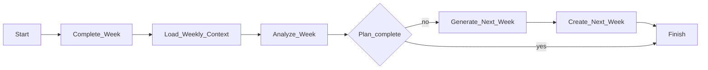
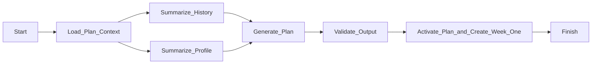

# Workflows (MVP)

The MVP retains the POC's two Temporal workflows:

1. weekly progression — completed training week → adjusted next week;
2. plan generation — completed plan → new plan + first week.

They run in `apps/workflows` on the local Node machine, with durable state and retries managed by Temporal Cloud. Activities read and write product data only through the authenticated internal API described in [api_contracts.md](./api_contracts.md).

The browser starts a workflow asynchronously and polls its status. It never waits for an LLM response.

## Shared rules

- Every LLM activity receives the Braintrust-backed `LlmCallRecorder`.
- Every LLM call—including failed calls—creates a provider trace; no LLM trace data is stored in D1.
- Every write command carries `workflow_id`, so a Temporal retry returns existing output instead of creating a duplicate plan or week.
- Product data remains in D1. Temporal retains workflow execution state/result; Braintrust retains LLM traces/evals.
- Current coaching rules are included in every generation call. Rule versioning can be added later; MVP uses the active rules document.
- LLM structured output is validated with shared Zod schemas before any write.

## Weekly progression

**Trigger:** `POST /api/clients/:clientId/workflows/weekly-progression`

**Input**

```typescript
type WeeklyProgressionInput = {
  client_id: string;
  week_id: string;
};
```



### Steps

1. **Complete week**  
   Call the internal `complete` command. It validates that the referenced week is the client’s only `in_flight` week, then marks it `completed`. This freezes the schedule/logs used for coaching.

2. **Load context**  
   Read the completed week, active plan, client profile, and coaching rules through the internal weekly-context endpoint.

3. **Analyze week**  
   Invoke the LLM with completed-day status, skipped exercises, exercise feedback, performed sets versus prescription, active plan, and coaching rules.  
   The analysis produces actionable guidance for generation only. It is held in workflow memory/history and traced in Braintrust; it is **not persisted in D1** or returned as a durable product artifact.

4. **Check plan boundary**  
   If `week_index >= plan.total_weeks`, finish with `plan_complete: true`. The UI offers plan generation; the weekly workflow does not automatically create a new plan.

5. **Generate next week**  
   If weeks remain, call structured generation with the completed week, canonical plan template, analysis, and coaching rules. The output is a full `WeekDay[]` schedule for the next dated week.

6. **Create next week**  
   Validate the schedule and call the idempotent internal create-next-week command. It creates the sole next `in_flight` week.

**Result**

```typescript
type WeeklyProgressionResult = {
  next_week_id: string | null;
  plan_complete: boolean;
};
```

### LLM calls and POC mapping

| MVP activity | POC activity | Output |
| --- | --- | --- |
| `analyzeWeek` | `analyzeWeeklyProgress` | Transient actionable analysis |
| `generateNextWeek` | `generateNextWeekProgress` | Validated `WeekDay[]` schedule |

The POC's file names, filesystem tools, `finished` flag, and persisted analysis markdown are removed. The product equivalent is a completed `Week` row plus its schedule/logs.

## Plan generation

**Trigger:** `POST /api/clients/:clientId/workflows/plan-generation`

**Input**

```typescript
type PlanGenerationInput = {
  client_id: string;
  notes?: string;
};
```

The workflow may start only after the active plan is complete. It reads all completed weeks associated with that plan.



### Steps

1. **Load context**  
   Read client profile, active plan, all completed weeks of that plan, and coaching rules.

2. **Summarize history and profile in parallel**  
   Run two independent LLM calls:
   - history summary: adherence, progression, skipped sessions, and `easy`/`hard`/`heavy`/`light` patterns;
   - profile summary: goals, current loads, nutrition/recovery constraints, swimming, and schedule preferences.

3. **Generate plan**  
   Invoke structured output generation with both summaries, the previous plan as a structural reference, coaching rules, and optional coach notes. The output contains the new block metadata, canonical `week_template`, and coach-facing rationale.

4. **Validate and activate**  
   Validate the generated plan with Zod, then call one idempotent internal command that:
   - archives the prior active plan;
   - creates and activates the new plan;
   - creates week 1 from the new template.

   Prior plans and completed weeks remain in D1. The POC behavior that deleted old program/progress files is not retained.

**Result**

```typescript
type PlanGenerationResult = {
  plan_id: string;
  first_week_id: string;
};
```

The rationale is stored on the generated `Plan`; summary text and other transient LLM intermediates are not product records.

### LLM calls and POC mapping

| MVP activity | POC activity | Output |
| --- | --- | --- |
| `summarizeHistory` | `summarizeProgressHistory` | Transient block summary |
| `summarizeProfile` | `summarizeClientProfile` | Transient profile summary |
| `generatePlan` | `generateNewPlan` | Validated plan + rationale |

## Retry and failure policy

| Step | Start-to-close timeout | Maximum attempts | Notes |
| --- | --- | --- | --- |
| Data reads/writes | 30 seconds | Temporal default | Internal commands are idempotent by `workflow_id` |
| Weekly analysis | 2 minutes | 2 | Limits repeated token spend |
| Next-week generation | 3 minutes | 2 | Structured-output validation failures are retryable |
| History/profile summaries | 2 minutes | 2 | Run independently |
| Plan generation | 3 minutes | 2 | Structured-output validation failures are retryable |

On final failure, Temporal marks the workflow failed. The public status endpoint exposes a safe error message and allows a deliberate retry. It must not expose raw prompts, model output, or provider credentials.

## Deferred behavior

- No scheduled weekly trigger: the user explicitly completes a week.
- No automatic plan-generation chain: plan completion prompts the user to start the second workflow.
- Streaming coach chat is not part of the MVP workflow surface.
- No product-table `JobRun` or `LlmCall`: Temporal and Braintrust provide those operational records.
