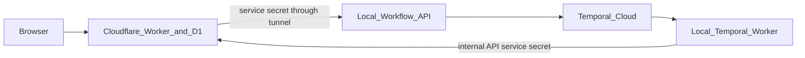

# Local workflow worker operations

MVP runbook for the local Mac machine that runs `apps/workflows` as a Docker Compose project. The Cloudflare Worker/D1 API remains public and independently deployed; this machine runs only private workflow processes.

## Responsibilities

The local machine runs three manually started containers:

| Process | Purpose | Network exposure |
| --- | --- | --- |
| Workflow-start API | Receives authenticated workflow-start/status requests from `apps/api` and calls Temporal Cloud | Docker network only |
| Temporal worker | Polls Temporal Cloud and executes workflow activities | Outbound only |
| Cloudflare Tunnel | Connects the private local API to the Cloudflare Worker | One controlled inbound route |

It does not run:

- the public browser API;
- D1 or any other product database;
- a self-hosted Temporal server;
- scheduled evaluation jobs.

## Network model



- The workflow-start API listens only on loopback (`127.0.0.1`).
- Cloudflare Tunnel forwards the configured tunnel route to that loopback port.
- `apps/api` includes a dedicated `WORKFLOW_SERVICE_SECRET` on every request through the tunnel.
- The local API rejects requests without that secret using a constant-time comparison.
- The local worker calls D1 indirectly through the authenticated `/internal/*` endpoints in `apps/api`; it never has D1 credentials or direct database access.
- The browser never sees the tunnel hostname or service secret.

The tunnel route is not sufficient authorization by itself. Treat it as transport; require the service secret at the local API.

## Secrets

Keep local secrets outside Git, in a file readable only by the account that runs the services.

```text
TEMPORAL_ADDRESS
TEMPORAL_NAMESPACE
TEMPORAL_API_KEY
OPENAI_API_KEY
BRAINTRUST_API_KEY
INTERNAL_API_BASE_URL
INTERNAL_API_SERVICE_SECRET
WORKFLOW_SERVICE_SECRET
TUNNEL_TOKEN
```

Responsibilities:

- `WORKFLOW_SERVICE_SECRET` is shared only by `apps/api` and the local workflow-start API.
- `INTERNAL_API_SERVICE_SECRET` is shared only by `apps/api` and the local workflow worker.
- The tunnel token is only used by the tunnel process.
- Rotate a secret by updating both ends, restarting affected services, and confirming health before revoking the old value.
- Never send secrets to Braintrust traces, Temporal workflow inputs, logs, or the browser.

## Container management

Use Docker Compose for the local workflow runtime. The compose project contains:

```text
workflow-api       # private workflow start/status API
temporal-worker    # polls Temporal Cloud and runs activities
cloudflared        # tunnel to workflow-api over the Compose network
```

- `workflow-api` and `temporal-worker` use the same `apps/workflows` image with different commands.
- `cloudflared` reaches `http://workflow-api:<port>` through the Compose network; no workflow port is published to the host or internet.
- Services use `restart: "no"`; startup and recovery are deliberate manual actions.
- Secrets are supplied through a Docker Compose environment file that is ignored by Git; they are not baked into the image or committed.
- The container image installs locked dependencies and contains the Node runtime, so local and later-managed hosting use the same artifact.

Expected commands:

```text
docker compose -f docker-compose.workflows.yml up -d --build
docker compose -f docker-compose.workflows.yml ps
docker compose -f docker-compose.workflows.yml logs -f temporal-worker
docker compose -f docker-compose.workflows.yml down
```

Docker Desktop and this Compose project are started manually. No `launchd` entry or automatic startup is configured for the MVP.

## Startup and health checks

Start in this order:

1. Ensure Docker Desktop is running and the repository has the intended release.
2. Build and start the Compose project.
3. Check the workflow API container health.
4. Confirm the Temporal worker has connected and is polling the intended task queue.
5. Confirm the tunnel container is connected and routes to the workflow API.
6. From the Cloudflare API environment, make an authenticated workflow-start health request through the tunnel.

The public Worker `GET /health` confirms edge availability only. It does **not** prove the local worker, tunnel, or Temporal poller is healthy.

## Deploy procedure

The local worker is intentionally not deployed by the public Worker deployment.

1. Merge a reviewed change.
2. Deploy `apps/api` and D1 migrations through the normal CI/CD path.
3. On the local machine, fetch the matching commit with a fast-forward-only update.
4. Rebuild and recreate the Compose project with the locked dependency image.
5. Confirm API health, tunnel connectivity, and Temporal polling.
7. Run one safe smoke workflow against a test client when workflow behavior changed.

Deploy order matters: deploy schema/internal API compatibility before a worker that depends on it. Keep internal API changes backward-compatible during the rollout window.

## Failure behavior and recovery

| Failure | User impact | Recovery |
| --- | --- | --- |
| Local machine/Docker offline | New workflows cannot start; public plan/history reads still work | Restore power/network and start the Compose project manually; queued Temporal work resumes |
| Tunnel disconnected | API cannot reach workflow-start service | Verify tunnel token/network; restart the `cloudflared` container manually; test authenticated route |
| Worker container stopped | Started workflows wait in Temporal; no product state is lost | Inspect container logs; restart worker manually; confirm polling |
| Workflow API container stopped | New workflow starts/status requests fail | Inspect container logs; restart API manually; confirm tunnel health |
| Activity fails | Workflow reaches Temporal retry/failure policy | Inspect Temporal/Braintrust trace; use public retry endpoint after fixing cause |
| D1/internal API unavailable | Activities fail or retry; no direct database fallback exists | Restore Cloudflare/internal API availability; let Temporal retry |

Temporal Cloud retains workflow state. A local outage delays work; it does not discard the execution history. This guarantee does not apply to uncommitted local process memory.

## Logging and observability

- Cloudflare: API/tunnel-adjacent request logs and D1 operational visibility.
- Temporal Cloud: workflow status, retries, and activity failures.
- Braintrust: every workflow LLM call, prompts/outputs, latency, and manual eval experiments.
- Docker Compose logs: container startup, crash, and tunnel diagnostics.

Use `workflow_id` as the correlation value across the local API, Temporal execution, internal API calls, and Braintrust traces. Do not log profile payloads or secrets unnecessarily.

## Manual evals

Evals are never a background process on this machine. Run the explicit commands in [evals.md](../architecture/evals.md) only when reviewing an LLM change:

```text
pnpm eval:score -- --trace <braintrust-trace-id>
pnpm eval:replay -- --trace <braintrust-trace-id>
```

These commands require the Braintrust and model-provider credentials and may incur model cost when replaying.

## When to move off the local machine

Move `apps/workflows` to managed Node hosting when any of these becomes true:

- workflow availability can no longer depend on home power/network;
- another person depends on timely workflow completion;
- local service updates are becoming operationally risky;
- the machine can no longer remain online and patched;
- you need high availability or formal incident response.

The move should change only deployment configuration. The Temporal workflow code, tunnel-facing start contract, internal API contract, and D1 model remain the same.
